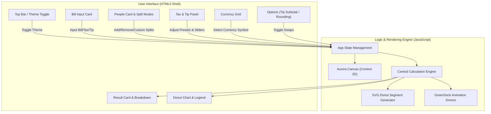
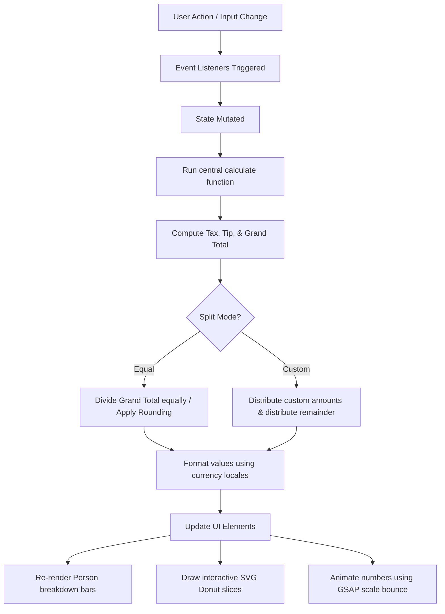

# Split — Futuristic Bill Splitter Architectural Design & Code Walkthrough

This document outlines the architectural design, tech stack, data flow, and code explanation of the **Split — Futuristic Bill Splitter** web application located in [split.html](file:///c:/Users/prudh/Downloads/split.html).

---

## 🛠️ Tech Stack & Design System

The application is structured as a **single-file modern web utility (monolith)** designed with premium glassmorphic visual aesthetics.

*   **Structure**: Semantic HTML5 markup layout.
*   **Styling**: Vanilla CSS3 featuring:
    *   **Dynamic Theme Variables**: Switchable variables supporting `--bg`, `--surface`, `--mint`, and gradient values. Supports a sleek `midnight` and a vibrant `neon` theme.
    *   **Aesthetics**: Glassmorphism using `backdrop-filter: blur()`, glowing borders, radial background grids, and responsive layouts.
    *   **Typography**: Interactive display typeface (`Space Grotesk`) and legible body copy (`Inter`) fetched dynamically via Google Fonts.
*   **Animation**: GreenSock Animation Platform (**GSAP**) + **ScrollTrigger** for hardware-accelerated entrance cascades, theme rotations, custom bounce keyframes, and layout scaling.
*   **Vector Engine**: Inline SVG elements for creating dynamic visualizations (e.g. the donut chart).

---

## 🏗️ Architectural Design

The application follows a **Reactive Component Architecture** where state mutations immediately update the user interface without virtual DOM overhead.



---

## 🔄 Program Data Flow

The app operates on an **event-driven state-propagation loop**:



1.  **Input Trigger**: The user modifies the bill total, tax rates, custom tips, toggles options, or updates individual names.
2.  **State Update**: The local JavaScript `state` object captures new parameters.
3.  **Calculation Processing**: The application executes `calculate()` which recalculates values down to decimal precision.
4.  **UI Syncing**: The DOM is updated sequentially:
    *   Individual share bars recalculate widths.
    *   SVG slices of the donut chart reconstruct their dash arrays.
    *   GSAP fires custom bounce animations if totals change.

---

## 🔍 Detailed Code Explanation

### 1. Canvas Aurora Background
The dynamic background is constructed using an HTML5 Canvas drawing loop:
*   Three colorful gradient points (orbs) move smoothly via trigonometric functions (`Math.sin` and `Math.cos`).
*   On every frame, the background is cleared and radial gradients are rendered onto the screen.
*   **Aurora Reactivity**: Changing tips or bill amount calls `window.setAuroraHue()` to shift colors dynamically.

### 2. State Definition
All dynamic parameters are housed in a single global configuration object:
```javascript
let state = {
  currency: 'USD',
  tip: 15,
  mode: 'equal',
  people: [
    { id:1, name:'Alex', custom:null },
    { id:2, name:'Jordan', custom:null },
  ],
  nextId: 3,
  lastPerPerson: 0,
  theme: 'midnight',
};
```

### 3. Central Calculations (`calculate`)
Located inside the `<script>` tags, this function:
*   Extracts float variables from inputs.
*   Determines whether tip is calculated on the **Subtotal** or the **Grand Total** (which includes tax).
*   Handles the two split modes:
    *   **Equal**: Divides total cost by list length. If **Round Up** is checked, it rounds values to the next whole number and rolls the difference into a modified tip amount.
    *   **Custom**: Distributes specific user-input amounts, then distributes any remaining bill balance among participants who do not have custom inputs set.

### 4. Dynamic SVG Donut Chart
The donut chart is created on the fly by drawing `<circle>` elements inside `<svg id="donut-svg">`:
*   Circumference is calculated using $C = 2\pi r$ (where radius $r = 48$, giving a circumference of $\approx 301.59$ pixels).
*   Individual circles representing slices are styled with `stroke-dasharray` and `stroke-dashoffset` offsets computed using percentages:
    ```javascript
    const pct = amt / total;
    const dash = pct * circ;
    const gap  = circ - dash;
    circle.setAttribute('stroke-dasharray', `${dash} ${gap}`);
    circle.setAttribute('stroke-dashoffset', -offset * circ);
    ```
*   This removes the need for external heavy graphing library dependencies (e.g. Chart.js).
